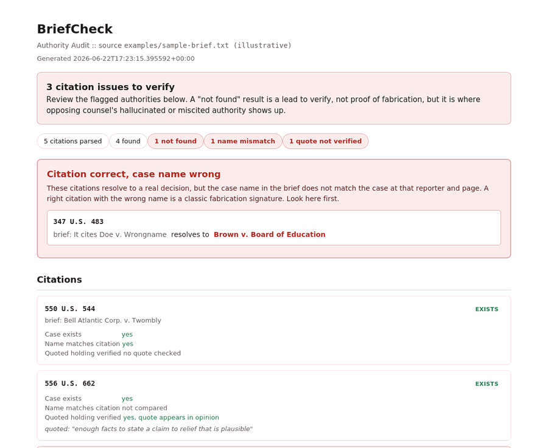

# BriefCheck

**Authority Auditor for Legal Briefs**

_Designed by PinkViper Labs._



BriefCheck reads an opposing brief, pulls every case citation, and checks three things against CourtListener: does the case actually exist, does the quoted passage actually appear in the cited opinion, and is there negative-treatment language in later opinions. It is built on CourtListener's Citation Lookup and Verification API, which uses the Eyecite parser and is designed specifically as a guardrail against hallucinated citations.

The existence check is the one that bites right now. Fabricated and miscited authorities are getting attorneys sanctioned, and a single invented or dead citation in an opponent's filing, surfaced and raised, costs them credibility with the court for the rest of the case. BriefCheck finds them in one pass. It runs on your machine against the public API. No database, no stored briefs.

## Not legal advice, and what this is not

BriefCheck verifies citations against CourtListener, whose coverage of federal and state case law is large but not complete. A "not found" result means the citation did not resolve there. It is a strong lead to verify, not proof the case is invented. Quote verification confirms whether a quoted passage literally appears in the cited opinion; it does not judge whether the holding is characterized fairly. The treatment screen looks for negative-treatment words in later opinions and is **not** a substitute for Shepard's or KeyCite. Confirm every flag against the primary source before relying on it.

## Get a token

BriefCheck talks to the public CourtListener API. Get a free token from your CourtListener profile at `https://www.courtlistener.com/profile/`, then set it:

```
export COURTLISTENER_TOKEN="your-token-here"
```

On Windows PowerShell: `setx COURTLISTENER_TOKEN "your-token-here"`. The token is never stored by BriefCheck; it is read from the environment at runtime.

## Install

```
git clone https://github.com/jaderileyburch/briefcheck.git
cd briefcheck
python -m venv .venv
source .venv/bin/activate
pip install -r requirements.txt
```

Requires Python 3.10 or newer. Plain text and Markdown briefs work out of the box. To read PDF or Word briefs directly, also install one of `pdfplumber` or `pypdf` (PDF) and `python-docx` (.docx), or export the brief to a `.txt` file first.

## Quick start

```
python cli.py check examples/sample-brief.txt
python cli.py report examples/sample-brief.txt
```

`check` prints a summary and lists the flagged citations. `report` writes a standalone HTML report (default `out/briefcheck.html`).

## Commands

| Command | What it does |
|---|---|
| `check <brief>` | Audit the brief and print the citation summary |
| `report <brief>` | Write an HTML authority-audit report |

Options on both: `--treatment` to also screen later opinions for negative treatment (slower, opt-in, off by default), and `--no-quotes` to skip quoted-passage verification.

## The three checks

**Does the case exist.** The whole brief is sent to the Citation Lookup API, which parses every citation with Eyecite and returns a status for each: found, valid-but-not-found, an invalid reporter, or a citation matching more than one decision. A not-found or invalid-reporter result is flagged. BriefCheck also compares the case name the brief used to the name CourtListener resolves for that reporter and page, so a citation with the right numbers but the wrong case name (a classic hallucination signature) is caught. The report leads with a dedicated "Citation correct, case name wrong" section for exactly these, since they are the first thing worth looking at.

**Is the quoted holding accurate.** When the brief quotes language at a citation, BriefCheck fetches the cited opinion and checks whether that exact passage appears in it. This is a verbatim verification, not a model's judgment: it catches fabricated and misattributed quotes. It does not opine on whether the holding is characterized fairly.

**Is it still good law.** Optional, with `--treatment`. BriefCheck pulls the later opinions that cite the case from CourtListener's citation graph and scans them for negative-treatment language (overruled, abrogated, superseded, and the like). This is a screen to point you at cases worth Shepardizing, not a citator itself.

## How it handles size and limits

The Citation Lookup API accepts up to 64,000 characters and 250 citations per request. BriefCheck chunks longer briefs automatically and maps the results back to the right place in the text. The lookup does not resolve statutes, law-journal citations, or `id.`/`supra` references; those are simply not checked.

## Development

```
pip install -r requirements-dev.txt
pytest
```

Tests cover the citation and quote extraction and the full check orchestration using an offline fake client, so the suite runs without a token or network. The live API path needs your token to exercise.

## License

Released under the MIT License. See `LICENSE`.

## Disclaimer

BriefCheck is a verification aid, not legal advice, and does not create an attorney-client relationship. CourtListener coverage is not exhaustive. Confirm every result against the primary source.
